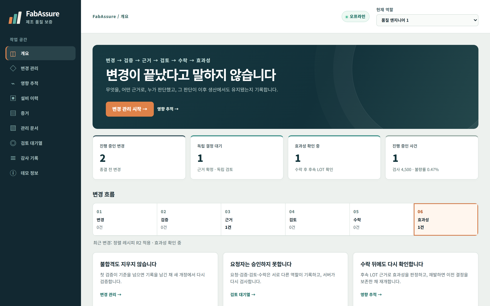

# FabAssure

**변경 → 검증 → 근거 → 검토 → 수락 → 효과성**

FabAssure는 제조 변경을 이 여섯 단계로 기록하는 제조 변경 품질 관리 소프트웨어입니다(오프라인 실행). 변경이 끝났다고 말하지 않고, 무엇을 어떤 근거로 누가 판단했으며 그 판단이 이후 생산에서도 유지됐는지 남깁니다.



## 핵심 기능

- **변경·검증** — 위험 분류와 승인된 검증 기준. 첫 검증이 불합격이면 기록을 남긴 채 새 개정에서 다시 검증합니다.
- **근거** — 측정·AOI 원천 기록만 근거로 연결하고, 기준과 관측값을 같은 표에서 판정합니다.
- **검토·수락** — 요청자·검증자·검토자·승인자를 분리하고 서버가 모든 상태 전이와 역할을 다시 검사합니다.
- **효과성** — 수락 후 후속 LOT으로 판단을 다시 확인합니다. 데이터가 부족하면 종결할 수 없고, 재발하면 이전 결정을 보존한 채 재개합니다.
- **영향 추적** — 설비 이력과 마지막 정상 관측(LKG)으로 노출 구간을 계산하고 LOT을 확정 영향·노출 가능·불확실·제외로 나눕니다. CAPA와 관리 문서 개정까지 연결합니다.

## 시작하기

Windows x64에서 인터넷 없이 실행하는 번들은 [시작 안내](README_FIRST_KO.md)를 따릅니다. 소스에서 번들을 만들려면 공식 Node.js **v24.19.0 Windows x64** ZIP을 준비한 뒤 PowerShell에서 실행합니다.

```powershell
.\scripts\build-portable.ps1 -NodeArchive <공식-Node-ZIP-경로> -OutputDirectory .\dist\FabAssure
.\dist\FabAssure\verify-offline.cmd
.\dist\FabAssure\start-fabassure.cmd
```

브라우저에서 `http://127.0.0.1:4310`을 열고 **변경 관리 → 영향 추적 → 설비 이력** 순서로 살펴보세요. 진행 순서는 [데모 가이드](docs/demo-guide.md)에 있습니다.

## 문서

[업무 흐름](docs/workflow.md) · [아키텍처](docs/architecture.md) · [검증 결과](docs/validation.md) · [한계](docs/limitations.md) · [개발 방법](docs/development-method.md) · [포트폴리오 PDF](portfolio/FabAssure-SKhynix.pdf)

샘플 데이터로 동작하며 실제 MES·설비와 연결되지 않습니다.
